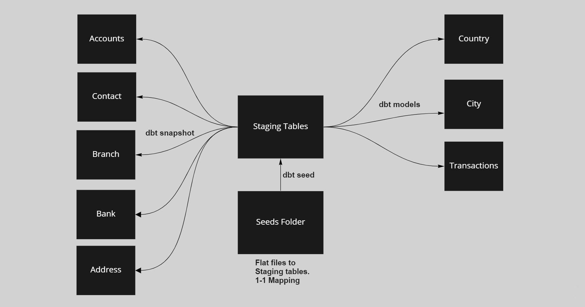
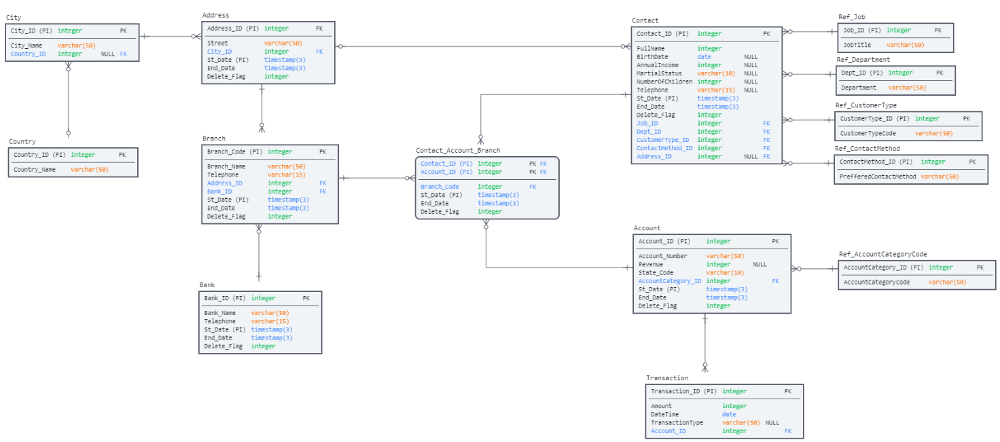

# Dbt_With_SnowFlake


### Table of Contents

- [Overview](#overview)
- [Data Build Tool](#data-build-tool)
- [Folder Structure](#folder-structure)
- [Program Flow](#program-flow)
- [Program Execution](#program-execution)
- [Data Model](#data-model)
- [Level Up](#level-up)
- [Documentation and Material](#documentation-and-material)
- [Tools and Technologies](#tools-and-technologies)

---


### Overview

- The purpose of doing this was to learn how Tranformations step can be made easy using data build tool (dbt).
- Check what different functionalities does dbt support that can save development time.
- Snowflake was used as a warehouse. Free 30 day trail.


---

### Data Build Tool

- dbt enables analytics engineers to transform data in their warehouses by simply writing select statements.
- dbt handles turning these select statements into tables and views.
- dbt does the T in ELT (Extract, Load, Transform) processes.
- dbt provides a web UI that can be used to visualize the lineage of how can is moving.
- dbt web UI also provides detail about each model and what it depends on as well the as test cases on certain models.

<p align="center">
  
</p>

#### dbt Installation

- Install git and python 
- dbt installation on Linux has some problem and due to that we need install the dbt-core project.
- Will be doing this all in a virtual environment.

- This will create a virtual env
```bash
  python3 -m venv dbt-env
```

- Activate the env
  - Keep in mind to be in the correct folder 
```bash
  source dbt-env/bin/activate
```
- In this repo dbt is also ready there you can use that or clone there repo.
```bash
  git clone https://github.com/dbt-labs/dbt.git
```

- Go into the dbt folder
```bash
  cd dbt
  pip install -r requirements.txt
```

- Check if dbt installed
```bash
  dbt --version
```

- Download the Snowflake Plugin
```bash
  pip install dbt-snowflake
```

- Open your choice of editor, VS Code used in this demo. Running the command will populate with different folders (seeds, models etc)
```bash
  dbt init <project-name>
```

#### Connecting dbt with Snowflake

- Snowflake provides 30 day free trail.
- When dbt installed and configured, in home directory a **.dbt** will be visible.
- Two file will be present.
  - profile.yml
  - .user.yml
- In the profile.yml we provide our Snowflake credentials. Refer to dbt documentation.
- https://docs.getdbt.com/reference/warehouse-profiles/snowflake-profile
```bash
dbt_model:
  outputs:
    dev:
      account: ap12345.ap-south-1.aws
      database: <database>
      password: <password>
      role: <role-from-snowflake>
      schema: <schema>
      threads: 2
      type: snowflake
      user: <username>
      warehouse: <warehouse-name-from-snowflake>
  target: dev
```

- When snowflake profile has been set, execute this will tell, if connection made.
```bash
  dbt debug
 ```


---


### Folder Structure
- dbt &emsp;&emsp;&emsp; - dbt cloned repo used for installation
- dbt-evn &emsp;&nbsp;- python virtual env related
- dbt-model 
  - dbt-model &emsp; - after dbt init <name> this is created
    - analyses
    - macros &emsp;&emsp;&emsp;&emsp;&emsp; - create macros here and refer later
    - models &emsp;&emsp;&emsp;&emsp;&emsp; - tables, views, incremental load, merge 
    - seeds &emsp;&emsp;&emsp;&nbsp;&nbsp;&emsp;&emsp; - flat files incase want to load to staging using dbt
    - snapshots &emsp;&nbsp;&nbsp;&emsp;&emsp; - SCD tables
    - tests &emsp;&emsp;&emsp;&emsp;&emsp;&emsp; - tests on different models
    - dbt_project.yml &emsp;&nbsp; - one place to configure all
    - packages.yml &emsp;&emsp; - dbt has many packages which can be downloaded


---

### Program Flow

<p align="center">
  
</p>


---

### Program Execution
  
- Before executing any of the commands remember to be in the correct folder.
```bash
  cd <project-name>
```
  
- To load file from seeds folder to Stage Tables in snowflake
```bash
  dbt seed
```
  
- The data will be in the Stage Tables, now will load data to Core/Dim tables.
  - City, Country, Transations will be loaded as they have no history handling needed.
```bash
  dbt run
```

- The Snapshot folder has all those models on which SCD-2 is being used.
```bash
  dbt snapshot
```
  
- We can also check test cases that are defined on different models, snapshots, seeds 
```bash
  dbt test
```
- dbt provides a web UI that can be accessed using.
  - Internally it has all metadata in json that is saved and used by the web UI
```bash
  dbt docs serve
```
  
  


---

### Data Model


<p align="center">
  
</p>

- The source system provides the Full Dump (all of the data every time).
- The Transactions table is append only data.
- Most the tables in Core/Dim are SCD Type 1 or Type 2.
- Country and City do not change much they can be loaded manually whenever needed.

---
 
### Level Up
  
- Right now just loading data to Core/Dim.
- Create a pipeline and orchectrate it using Airflow or Airbyte.
- Make Fact Table and visualizations on top of that.
- Use dbt test for testing purpose and different packages that can aid in development.

---  

### Documentation and Material

- [dbt documentation](https://docs.getdbt.com/docs/introduction)
- [dbt profile setup](https://docs.getdbt.com/reference/dbt_project.yml)
- [dbt Youtube Playlist](https://www.youtube.com/playlist?list=PLy4OcwImJzBLJzLYxpxaPUmCWp8j1esvT)
- [Snowflake Youtube Playlist](https://www.youtube.com/playlist?list=PLy4OcwImJzBIX77cmNYiXIJ3tBhpNSUKI)
- Thanks to Kahan Data Solutions for the demo videos.
  
---
### Tools and Technologies

- Dbt
- Snowflake
- Git

